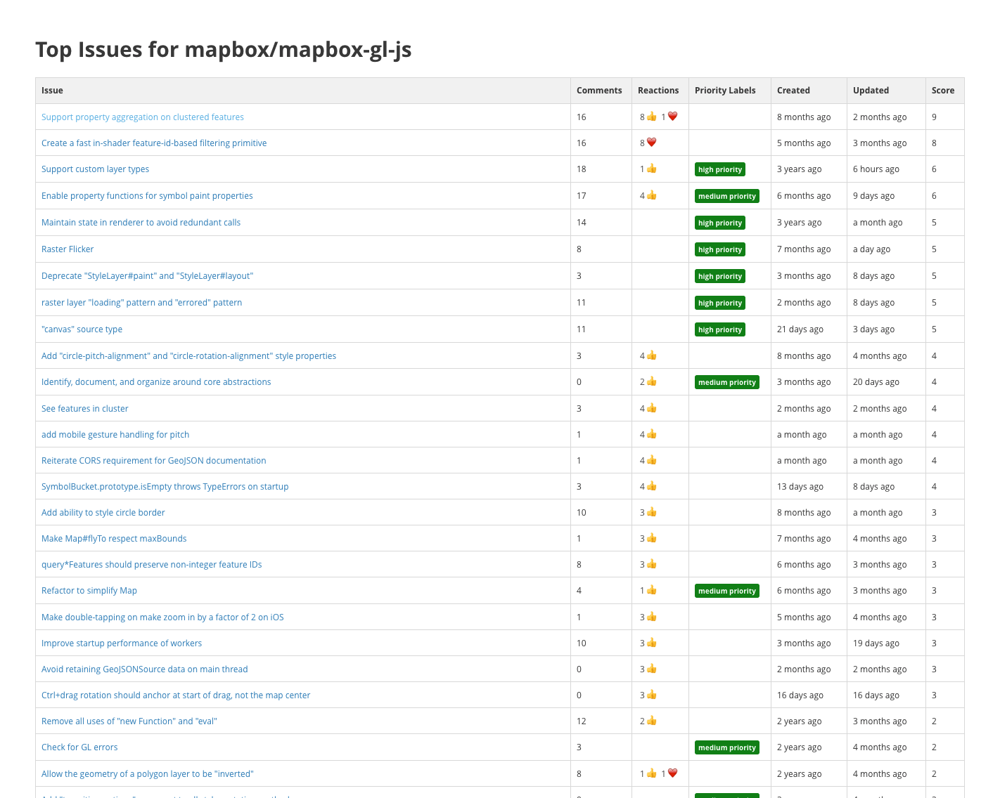

# Github Top Issues

This utility allows you to see the top issues (as measured by # of interactions, priority labels, and age) in any Github repository's issue tracker.

You can view the [top issues for mapbox/mapbox-gl-js](https://mapbox.github.io/top-issues/#!mapbox/mapbox-gl-js) at

```
https://mapbox.github.io/top-issues/#!mapbox/mapbox-gl-js
```

To view the top issues for another repository, replace the repository name in the URL (everything after the `#!`).
```
https://mapbox.github.io/top-issues/#!OWNER/REPOSITORY
```



## Rate Limiting

Github API requests are rate limited by IP address. You can raise the rate limiy by linking a [personal Github access token](https://help.github.com/articles/creating-an-access-token-for-command-line-use/). To link a link an access token, append `github_username` and `github_access_token` parameters to the URL
```
https://mapbox.github.io/top-issues/?github_username=USERNAME&github_access_token=ACCESS_TOKEN#!mapbox/mapbox-gl-js
```

## Private Repos

To use this tool with a private repo, append `github_username` and `github_access_token` parameters to the URL
```
https://mapbox.github.io/top-issues/?github_username=USERNAME&github_access_token=ACCESS_TOKEN#!secret-agent/top-secret-stuff
```
